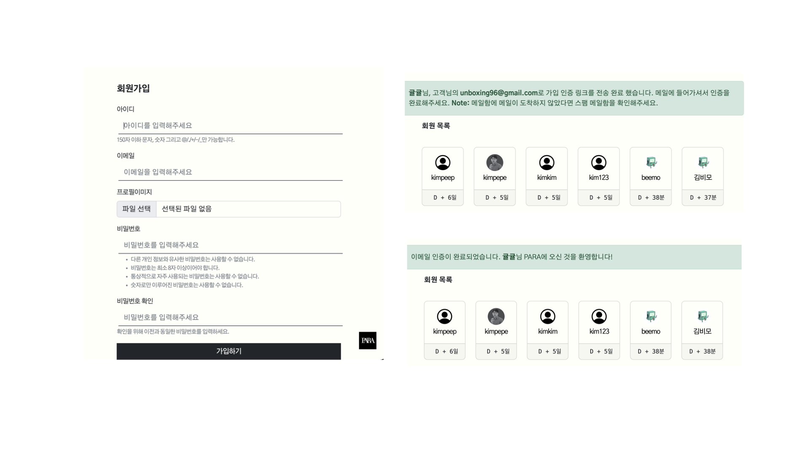
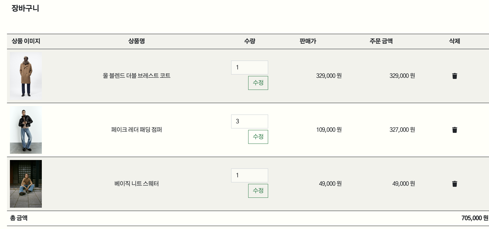

# PARA

> 배포주소: http://para-env.eba-ezj4wh6p.ap-northeast-2.elasticbeanstalk.com/  **(2022/11/20 ~ 2022/11/25)**
>
> 자라 사이트를 참고하여 만든 쇼핑몰 프로젝트

- `개발 기간` : **2022/11/9 ~ 2022/11/21**
- [기획서](기획서.md)
- [회고](회고.md)
- [발표자료](PARA.pdf)

### 직접 구현
[구현한_기능](구현기능.md)
## 목차

- [Contributors](#contributors)
- [기술 스택](#-기술-스택)
- [Role](#role)
- [주요 기능](#주요-기능)
- [페이지 구성 상세](#-페이지-구성-상세)
  - [main.html](#mainhtml)
  - [Accounts App](#accounts-app)
    - [accounts/signup.html](#accountssignuphtml)
    - [accounts/login.html](#accountsloginhtml)
    - [accounts/index.html](#accountsindexhtml)
    - [accounts/detail.html](#accountsdetailhtml)
    - [채널톡 API](#채널톡-api)
  - [Products App](#products-app)
    - [products/index.html](#productsindexhtml)
    - [products/detail.html](#productsdetailhtml)
  - [Cart App](#cart-app)
    - [cart/detail.html](#cartdetailhtml)
  - [Reviews App](#reviews-app)
    - [reviews/detail.html](#reviewsdetailhtml)
    - [taggit](#taggit)
  - [Navbar](#navbar)
    - [Profile](#profile)
    - [매장 찾기](#매장-찾기)
    - [searched.html](#searchedhtml)
    - [bestseller.html](#bestsellerhtml)
    - [category.html](#categoryhtml)
  - [모바일 화면](#모바일-화면)
- [후기](#후기)

 

## Contributors

 

## ⚙️ 기술 스택

&nbsp;&nbsp;&nbsp;&nbsp;&nbsp;

&nbsp;&nbsp;&nbsp;&nbsp;

 

## Role

| 이름   | 역할                                                         |
| ------ | ------------------------------------------------------------ |
| 박태호 | **팀장** **풀스텍**(`소셜 로그인`, `댓글/대댓글 비동기 구현`, `사용자 위치 기반 매장 위치 안내(카카오API)`) |
| 손희준 | **백엔드**(`Reviews App CRUD 구현`, `해시태그 기능 구현`)    |
| 송희수 | **백엔드**(`Products App`, `장바구니`)                       |
| 황여원 | **백엔드**(`해시태그`, `소셜 로그인`, `Accounts App` , `검색기능`) |
| 김태현 | **백엔드**(`크롤링`, `회원가입 시 이메일 인증`, `채팅`, `장바구니`) |
| 류진숙 | **발표** **프론트엔드** (`팔로우기능 비동기 구현`, `팀원들 오류 발생 시 디버깅`, `category.html gender 분류 구현`) |

 

## 주요 기능

- 회원 가입 시 이메일 인증
- 소셜 로그인(`네이버`, `카카오`)
- CRUD
- 조회 수
- 상품 찜하기 비동기 구현
- 장바구니 기능
- `reviews/detail.html` 댓글/대댓글 생성, 삭제 비동기 구현
- 해시태그 기능(`taggit` 사용)
- 사용자 위치 기반 주변 매장 안내 기능(`카카오 API` 사용)
- 회원 간의 팔로우/팔로잉 비동기 구현
- 로컬에서의 채팅 기능
- `products/bestseller` - 조회 수를 기준으로 내림차순 정렬
- 카테고리(옷 분류) 안의 카테고리(성별 분류) 기능
- 반응형 웹페이지 완성

 

## 📂 페이지 구성 상세 

### main.html

- `swiper` 라이브러리 사용
- 동영상 + 사진 캐러샐 구성
- 팀원의 기여도 확인 가능한 깃헙 페이지 이동
- `products/index.html`로 이동하는 버튼

 

### Accounts App

#### accounts/signup.html

- 회원 가입 폼 작성 후, 가입하기 버튼 클릭 시
- 회원 인증 메일이 전송 완료 되었다라는 알림 창이 뜨게 됨 메일함에 들어가 주소를 클릭 하면,
- 이메일 인증이 완료되었다는 알림 문구가 뜨게 됨
- 이메일 인증 완료하지 못한다면 accounts/index.html에는 회원이 등록된 것 처럼 보이나
  - is_active가 1이 되지 못했으므로 로그인을 진행할 수 없다
- 이메일 인증 만료 시간 **4시간**으로 설정

 

#### accounts/login.html

- 로그인 폼과, `signup.html`로 이동하는 버튼 존재
- 네이버 로그인, 카카오 로그인 진행 시 오른쪽 사진처럼 나타나게 됨 - 소셜 로그인 진행 가능

 

#### accounts/index.html

- 카드 형태로 사용자의 프로필, 아이디, 가입일로부터 경과일 출력

 

#### accounts/detail.html

- 로그인한 유저 **자신의 프로필**

  - 수정하기 버튼 출력 > 수정 폼
  - 팔로우/팔로잉 개수, 찜 목록 개수
  - 나의 찜 목록, 리뷰 작성한 상품에 대한 정보 무한 자동 캐러샐로 구현(`slick` 라이브러리 사용) - 반응형 구현

- **다른 유저의 프로필**

  - 팔로우/언팔로우 버튼 비동기 구현

  - DM 클릭시 채팅으로 이동 - 다른 사용자에게 채팅 가능

    

 

#### 채널톡 API

- 채널톡 API 사용하여 PARA 챗봇 커스텀

 

### Products App

#### products/index.html

- 크롤링으로 products App DB 구성
- 전체 상품 목록 출력
- 각 상품 호버 시 사진 확대와 함께 상품명 표시

 

#### products/detail.html

- 상품 정보(상품 이름, 상품 설명, 상품 색상, 상품 가격) - 크롤링 사용하여 DB 저장한 정보
- 리뷰 평균 별점
- 사용자가 상세 이미지를 보면서도 상세 설명과 장바구니에 담을 수 있게 상품정보 토글기능 구현
- 찜하기 기능 비동기 구현
- 조회수 구현
- 리뷰 목록 모음

 

### Cart App

#### cart/detail.html

- `products/detail.html` 에서 담은 상품 정보들이 테이블에 출력
  - `상품 이미지`, `상품명`, `수량`, `판매가`,` 주문 금액`, `삭제`, `총 금액`
- 수량 변경 후 수정 버튼 클릭 시 주문 금액 변경

 

### Reviews App

#### reviews/detail.html

- 해시태그 기능
- 댓글 대댓글 생성부터 삭제까지 비동기로 구현
- 답글 목록, 답글 토글로 구현
- 댓글 클릭시 댓글 원문 모달로 띄우게끔 구현

 

#### taggit

- 해당 해시태그를 사용한 리뷰 목록
- 전체 해시태그 목록
  - 각 해시태그를 사용한 리뷰 총 목록 개수 뱃지로 출력

 

### Navbar

#### Profile

- 프로필 클릭시 드롭다운
  - **내 프로필** (accounts/detail로 이동)
  - **회원 목록**(accounts/index로 이동)

 

#### 매장 찾기

- 사용자의 위치 기반 주변 매장 정보 출력 (**카카오 지도 API 활용**)
  - 마우스 오버시 매장의 정보(이름) 출력
  - `내 위치` 마커로 표시

 

#### searched.html

- 검색 결과 없는 경우 랜덤 상품 10개 목록 출력
- 검색 결과 있는 경우 해당 상품 목록 출력

 

#### bestseller.html

- **조회수를 기준**으로 내림차순으로 12개의 상품 정렬
- 각 상품 사진을 클릭하면 products/detail 페이지로 연결

 

#### category.html

- 전체 제품을 **옷 분류 별**로 1차 카테고리화 그 후 **성별을 기준**으로 다시 카테고리화
  - 카테고리 안의 카테고리
- 맨 처음 페이지는 남/여 성별의 구분 존재 X
- `MAN/WOMAN` 버튼 누르면 해당 옷 분류의 상품중 해당 성별의 상품만 출력
  - 같은 버튼을 다시 누르면 다시 맨 처음 페이지인 성별 무관 목록으로 돌아감
  - 자바스크립트 토글로 구현

 

### 모바일 화면

 

## 후기

- `김태현`

  기획 단계를 아주 아주 꼼꼼히 해야 한다고 느꼈습니다.
  새로운 기능을 익힐 때 제일 빠른 건 공식 문서라고 또 한 번 배웠습니다.
  열정 있는 팀원분들 덕분에 잘 마무리 할 수 있었어요. 8조 모두 감사해요 !!

- `박태호`

  지난 프로젝트 회고하며 해보고 싶은 기능들이 많았는데 이번에 크롤링, 대댓글, 소셜로그인을 구현해봐서 좋은 경험이었습니다. 댓글, 대댓글 비동기 처리를 진행하면서 React으로 하면 쉽게 구현이 된다는 정보를 들어서 학습하고 싶어졌다. 구현은 했지만 깔끔하지 못한 코드를 보면서 다음 구현에는 더 깔끔하게 해야겠다는 생각을 했다. 팀장으로 역할을 완벽히 소화하진 못했지만 팀원 분들이 다들 책임감을 가지고 맡은 역할을 잘 해주셔서 훈훈한 프로젝트이었습니다. 고생하셨습니다!  

- `손희준`

  해시태그에 대한 이해가 늘었다. 해시태그를구성할 때, [.select_related("product")]로 
  연관된 DB를 함께 불러오는 게 떠오르지도 않았고 DB를 구성하는데 시간을 많이 잡아 먹었다 

- `류진숙`
  
  자라 클론코딩을 해서 프론트는 제법 수월하게 진행할 수 있었던 것 같다. 프론트를 하다보니 추가 기능 구현에 참여하지 못한건 아쉽지만, 프론트를 만지면서 백을 수정해야 할 상황도 있었고, 다른 팀원들의 디버깅을 도와주면서 실력 향상이 될 수 있었던 프로젝트였다. 팀원분들도 기능 구현을 엄청 빠르게 하셔서 이번 프로젝트는 비교적 여유롭게 진행할 수 있었던 것 같다. 다들 최고최고

- `황여원`
  
  첫번재 프로젝트때 해보지 못했던 해시태그, 소셜로그인 등을 할 수 있어서 좋았고 매일 프로젝트를 끝낸 후 자기가 하루동안 구현한 기능을 설명하는 시간을 가져서 다른 팀원들이 진행했던 지도 API, 크롤링등의 기능을 배울 수 있어서 좋았습니다.

- `송희수`

  쿠키로 하는 장바구니 구현이 쉽지않아 오래 걸려서 해보고 싶은 기능들을 못해본거 같다. 또한 비동기처리를 처음 해봤는데 조금 어려웠지만 해볼만한거 같다. 다음에는 해보고 싶은 기능들을 꼭 해보고싶다.
  다들 열정적으로 해주셔서 감사합니다. 좋은 인연은 만든거 같네요. 다들 고생하셨습니다.
